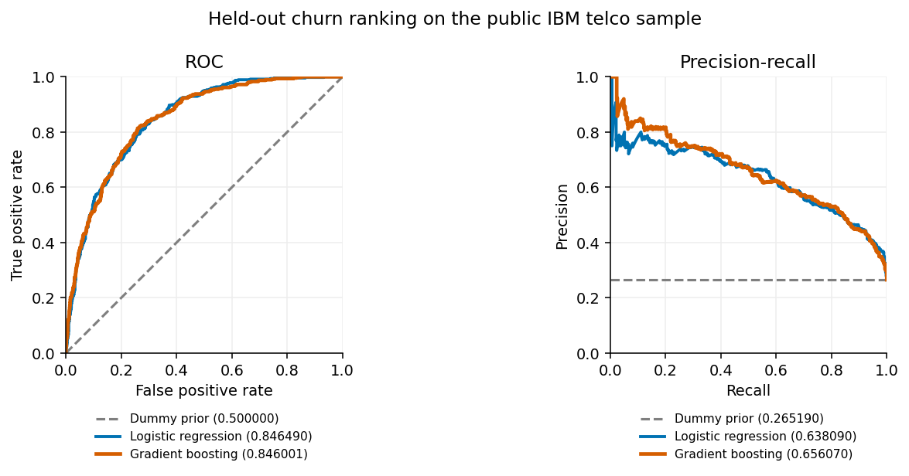
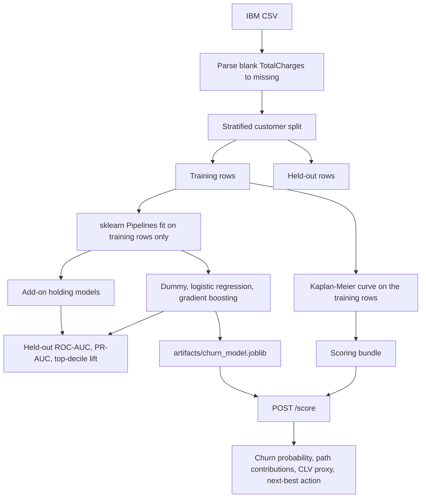

# Telco churn, propensity, and next-best-action

[](https://github.com/ChristopherKiokoStrathmore/telco-churn-nba-engine/actions/workflows/ci.yml)
[](https://www.python.org/)
[](LICENSE)

Telcos lose revenue to churn. Which customers should a retention team contact, and with what offer?

This repo builds a churn model, add-on propensity models, a CLV proxy, and a readable next-best-action rule table, served one customer at a time through a FastAPI `POST /score` endpoint in Docker. Part of an independent portfolio series on telecom customer analytics, built alongside my MSc in Data Science. Structured using CRISP-DM.

## Key results

The numbers below are copied from `reports/metrics.json` and from `examples/score_response.json`, both written by `python -m telco_nba.train`.



Held-out test set, 1761 customers (seed 42, stratified 25% split):

| Model | ROC-AUC | PR-AUC | Top-decile lift |
| --- | ---: | ---: | ---: |
| Dummy prior | 0.500000 | 0.265190 | 1.000000 |
| Logistic regression | 0.846490 | 0.638090 | 2.785308 |
| Gradient boosting (served) | 0.846001 | 0.656070 | 2.806733 |

- The top 10% of customers by gradient boosting score churn at 2.8 times the base rate (lift 2.806733).
- `POST /score` returns churn probability, top reasons, CLV proxy, add-on propensities and the next-best action. Runs in Docker, tested in CI.

`scripts/plot_curves.py` draws the curves from the committed scoring bundle and this same holdout.

## Business Understanding

Historical churn labels support a ranking model. They do not, by themselves, say whether a call or an add-on is the right next step. This repo keeps those pieces separate:

- a leak-free classifier for churn, with a dummy baseline
- lookalike models for current add-on holding
- a Kaplan-Meier retention curve used only as a CLV proxy
- a readable rule table, not an uplift model
- `POST /score` for a one-customer decision

## Data Understanding

| Item | Value |
| --- | --- |
| Dataset | IBM Telco Customer Churn |
| File | `data/Telco-Customer-Churn.csv` (unchanged bytes) |
| Source | https://raw.githubusercontent.com/IBM/telco-customer-churn-on-icp4d/master/data/Telco-Customer-Churn.csv |
| Repository | https://github.com/IBM/telco-customer-churn-on-icp4d |
| License | The repository is Apache-2.0. That license covers the code pattern. The repository does not state a separate license for the CSV. See `data/SOURCE.txt`. |
| SHA-256 | `16320c9c1ec72448db59aa0a26a0b95401046bef5d02fd3aeb906448e3055e91` |
| Rows | 7043 (7,043 in the usual citation of this file) |
| Columns | 21 |
| What it is | IBM's public US telco sample. The CSV has no country column. It is not Kenyan operator data. |
| Churn = Yes | 1869 customers, rate 0.265370 |
| Internet customers | 5517 |
| OnlineSecurity = Yes among internet customers | 2019 |
| TechSupport = Yes among internet customers | 2044 |
| Blank `TotalCharges` | 11, and all 11 of those rows have tenure 0 |

`scripts/download_data.py` fetches the same URL and checks the SHA-256. The committed file already matches.

## Data Preparation

The split is drawn before any imputer, scaler, encoder, classifier, or Kaplan-Meier curve is fit. Preprocessing lives inside an sklearn `Pipeline`, so the test rows cannot change the learned medians or category sets. The seed is 42 and the test split is 25%, stratified on `Churn`. That yields 5282 training rows and 1761 test rows (train churn rate 0.265430, test churn rate 0.265190).

Blank `TotalCharges` cells are parsed to missing values with a row-wise cast. Median imputation is a pipeline step fit on the training rows only.



## Modeling

Three families are fit for churn and for each add-on: a dummy prior, logistic regression, and gradient boosting. Gradient boosting is the fixed scoring model. It uses `n_estimators` 100, `learning_rate` 0.1, `max_depth` 3, and `subsample` 1. Churn probability cutoffs are quantiles of 3-fold out-of-fold scores on the training split (`churn_high_quantile` 0.75, `churn_medium_quantile` 0.5). They are not chosen on the test set. The training environment recorded in the metrics file is Python 3.12, scikit-learn 1.5.2, and lifelines 0.30.0.

### CLV proxy

CLV here is `MonthlyCharges` times expected remaining tenure. Remaining tenure is the restricted mean of a Kaplan-Meier curve fit on the training split only, with churn as the event and tenure as the time. The integral stops at the last observed training tenure, 72 months, and is not extrapolated. At tenure 0 the curve's expected remaining time is 54.549242 months. On the training rows the CLV proxy median is 1717.619943 and the 75th percentile is 3311.917019. There is no margin, discount rate, or causal save effect in this number.

### Next-best-action rules

The rules live in `config/nba_rules.yaml`. First match wins. Frozen cutoffs from the training run:

| Cutoff | Value | Meaning |
| --- | ---: | --- |
| `churn_high` | 0.442962 | 0.75 quantile of out-of-fold training churn probabilities |
| `churn_medium` | 0.165703 | 0.5 quantile of those same probabilities |
| `clv_high` | 3311.917019 | 0.75 quantile of the training CLV proxy |
| `min_offer_propensity` | 0.400000 | Fixed policy constant, not an estimated uplift |

| Priority | Rule id | When | Action |
| --- | --- | --- | --- |
| 1 | `save_call` | Churn probability >= 0.442962 and CLV >= 3311.917019 | Save call. No offer. |
| 2 | `offer_high_risk` | Churn probability >= 0.442962, CLV below that bar, and at least one add-on is eligible | Offer the eligible add-on with the higher uptake propensity. A tie goes to OnlineSecurity. |
| 3 | `offer_medium_risk` | Churn probability >= 0.165703 and an eligible add-on has propensity >= 0.400000 | Offer that add-on. If both qualify, take the higher propensity. |
| 4 | `no_action` | Otherwise | No action. |

Eligible means the customer has internet service and does not already hold that add-on. A customer with no internet service is not scored by the uptake models.

On the 1294 held-out customers whose historical `Churn` label is No (the label is not a model input; it only defines who could still be contacted), the rules assign 108 save calls, 121 offers, and 1065 no-action outcomes. Of the offers, 61 are OnlineSecurity and 60 are TechSupport. Counts for every held-out customer, including those already labeled churned, are under `nba.test_all_customers` in the metrics file.

## Evaluation

Positive class is `Churn = Yes`. ROC-AUC, PR-AUC, and top-decile lift are all on the held-out test rows.

Top-decile lift uses the definition stored in the metrics file: k = floor(n_test / 10); rows whose score ties cross that cut share it in proportion to the tie group, so a constant score has lift 1. For churn, k is 176 and the test base rate is 0.265190. The dummy prior's PR-AUC equals that base rate, and its lift is 1.

| Model | ROC-AUC | PR-AUC | Top-decile lift |
| --- | ---: | ---: | ---: |
| Dummy prior | 0.500000 | 0.265190 | 1.000000 |
| Logistic regression | 0.846490 | 0.638090 | 2.785308 |
| Gradient boosting | 0.846001 | 0.656070 | 2.806733 |

On this split, logistic regression has the higher churn ROC-AUC. Gradient boosting has the higher PR-AUC and the higher top-decile lift. Both clear the dummy prior on all three metrics. `POST /score` still uses gradient boosting, because `config/nba_rules.yaml` fixes `scoring_model` before anyone looks at the test table. The rank is also stored as `churn.roc_auc_rank_high_to_low` in the metrics file: logistic regression, then gradient boosting, then the dummy prior.

### Add-on holding, not campaign response

The uptake models predict whether an internet customer **currently holds** OnlineSecurity or TechSupport. They are not models of campaign response, and they are not uplift. The same customer split is used. Internet customers only: 4139 training rows and 1378 test rows for each add-on. `top_decile_k` is 137.

`MonthlyCharges` and `TotalCharges` are excluded. In this sample the monthly bill is the price of the subscribed bundle, so the bill would reconstruct the holding instead of estimating a propensity. The target column itself is also excluded.

OnlineSecurity test base rate 0.361393.

| Model | ROC-AUC | PR-AUC | Top-decile lift |
| --- | ---: | ---: | ---: |
| Dummy prior | 0.500000 | 0.361393 | 1.000000 |
| Logistic regression | 0.777698 | 0.663449 | 2.080351 |
| Gradient boosting | 0.783194 | 0.658733 | 2.080351 |

Logistic regression leads on OnlineSecurity PR-AUC. Gradient boosting leads on ROC-AUC. The two lifts are the same. Both beat the dummy prior.

TechSupport test base rate 0.355588.

| Model | ROC-AUC | PR-AUC | Top-decile lift |
| --- | ---: | ---: | ---: |
| Dummy prior | 0.500000 | 0.355588 | 1.000000 |
| Logistic regression | 0.788309 | 0.677629 | 2.340116 |
| Gradient boosting | 0.790647 | 0.681856 | 2.381171 |

Gradient boosting leads TechSupport on ROC-AUC, PR-AUC, and lift. Logistic regression also beats the dummy prior on all three. The API uses the gradient boosting uptake models, again because that family is the fixed scoring model.

## Deployment

`POST /score` takes one customer's features and returns the churn probability, the top path contributions, the CLV proxy, the add-on propensities, and the next-best action.

Contributions are the gradient-boosting path decomposition: each tree's leaf equals its root plus the splits along the path, and those changes sum with the initial log-odds to `decision_function`. One-hot columns are added back under the original feature name. They are not SHAP values. SHAP for this model is written up in [responsible-ai-pack](https://github.com/ChristopherKiokoStrathmore/responsible-ai-pack).

The request below is the first held-out test customer with a numeric `TotalCharges`: id `5343-SGUBI`, historical `Churn` No. The id and the label are not sent to the model. The body is `examples/score_request.json`.

```bash
curl -s -X POST http://localhost:8000/score \
  -H 'Content-Type: application/json' \
  -d @examples/score_request.json
```

This customer's churn probability is 0.122990, which is below `churn_medium` 0.165703, so the rule is `no_action` even though the OnlineSecurity lookalike probability is 0.618604, above the 0.4 offer cutoff. The response from the API:

```json
{
  "churn_probability": 0.122990,
  "scoring_model": "gradient_boosting",
  "top_reasons": [
    {
      "feature": "Contract",
      "contribution": -0.357808,
      "direction": "decreases_churn_risk"
    },
    {
      "feature": "StreamingMovies",
      "contribution": -0.235742,
      "direction": "decreases_churn_risk"
    },
    {
      "feature": "MonthlyCharges",
      "contribution": -0.169382,
      "direction": "decreases_churn_risk"
    }
  ],
  "next_best_action": {
    "action": "no_action",
    "offer": null,
    "rule_id": "no_action",
    "rationale": "Churn risk, CLV, and offer eligibility do not match a save call or an offer."
  },
  "addon_propensities": {
    "OnlineSecurity": {
      "eligible": true,
      "probability": 0.618604,
      "reason": null
    },
    "TechSupport": {
      "eligible": true,
      "probability": 0.478232,
      "reason": null
    }
  },
  "clv_proxy": {
    "monthly_charges": 80.200000,
    "expected_remaining_months": 18.845956,
    "value": 1511.445671,
    "horizon_months": 72.000000
  },
  "explanation_method": "Path contributions along the gradient-boosting trees. They sum with the model intercept to the churn log-odds for this customer. They are not SHAP values."
}
```

`clv_proxy.value` is the six-decimal product of the displayed monthly charge and the displayed remaining months.

### Model artifact for the responsible-ai-pack repo

The model card, SHAP explanations, and fairness checks are in [responsible-ai-pack](https://github.com/ChristopherKiokoStrathmore/responsible-ai-pack): [MODEL_CARD.md](https://github.com/ChristopherKiokoStrathmore/responsible-ai-pack/blob/main/MODEL_CARD.md). That repo loads this churn model. It does not train a second one.

| Piece | Location |
| --- | --- |
| Churn pipeline | `artifacts/churn_model.joblib` |
| Feature schema | `artifacts/feature_schema.json` |
| Loader | `telco_nba.model_io.load_churn_model` |
| Full serving bundle | `artifacts/scoring_bundle.joblib` |

```python
from telco_nba.model_io import load_churn_model

model, schema = load_churn_model()
# Columns must be schema["feature_order"]. predict_proba(frame)[:, 1] is P(Churn="Yes").
```

The pipeline includes the training-split preprocessor. Classes are `[0, 1]`.

### Run

Requires Python 3.12.

`make install`, `make test`, `make train`, and `make serve` wrap the commands below.

```bash
python -m venv .venv
source .venv/bin/activate
pip install -r requirements.txt
python scripts/download_data.py
PYTHONPATH=src python -m telco_nba.train
pytest
PYTHONPATH=src uvicorn telco_nba.api:app --host localhost --port 8000
```

Docker:

```bash
docker build -t telco-churn-nba .
docker run --rm -p 8000:8000 telco-churn-nba
```

Tests cover the split and preprocessing, the metrics file against the saved models, the NBA rules, path contributions, and `POST /score`. GitHub Actions runs them from `.github/workflows/ci.yml`.

## Data and scope

Built on the public IBM Telco Customer Churn sample as an independent portfolio project.

## Limitations

- The training table is IBM's US telco sample, 7043 rows. It is not Kenyan data and says nothing about any operator's customers. A model card that treats these metrics as local performance would be wrong.
- Uptake scores are probabilities of **current holding** among people who already have internet. They are not the probability that someone accepts an offer, and they are not an uplift. Bill amounts are left out because they would leak the holding through the price of the bundle. Other current products are still features, so the score is a lookalike of today's base, not a response model.
- The CLV proxy is monthly price times a restricted mean remaining lifetime. It ignores margin, discounting, and whether a save call actually changes survival. Past 72 months the proxy remaining life is 0, because the curve is not extrapolated.
- The next-best-action table is a policy. It does not estimate the causal effect of a call or an offer. The probability cutoffs are training quantiles, and 0.4 is a fixed constant from the YAML file.
- There is one stratified 25% holdout (seed 42) and no hyperparameter search. Logistic regression beats gradient boosting on churn ROC-AUC on that split. The API does not switch models after seeing the test metrics.
- Local reasons are path contributions for this gradient boosting model, not SHAP, and not causes.
- Action counts above are for held-out customers with historical `Churn` No. Sending a customer who has already left through `/score` still returns a score; the historical label is not an input.

The model card for this churn model is [MODEL_CARD.md](https://github.com/ChristopherKiokoStrathmore/responsible-ai-pack/blob/main/MODEL_CARD.md) in [responsible-ai-pack](https://github.com/ChristopherKiokoStrathmore/responsible-ai-pack).

## Related projects in this series

- [responsible-ai-pack](https://github.com/ChristopherKiokoStrathmore/responsible-ai-pack) - model card, SHAP explanations, and a fairness audit for this churn model. See [MODEL_CARD.md](https://github.com/ChristopherKiokoStrathmore/responsible-ai-pack/blob/main/MODEL_CARD.md).
- [omnichannel-care-analytics](https://github.com/ChristopherKiokoStrathmore/omnichannel-care-analytics) - care journey KPIs on a labeled synthetic event log, plus the public Bitext telecom intent taxonomy.
- [care-automation-roi](https://github.com/ChristopherKiokoStrathmore/care-automation-roi) - contact-centre automation cost, payback, and sensitivity on illustrative inputs.
- [digital-care-roadmap](https://github.com/ChristopherKiokoStrathmore/digital-care-roadmap) - now, next, and later roadmap for this telecom customer analytics series.
